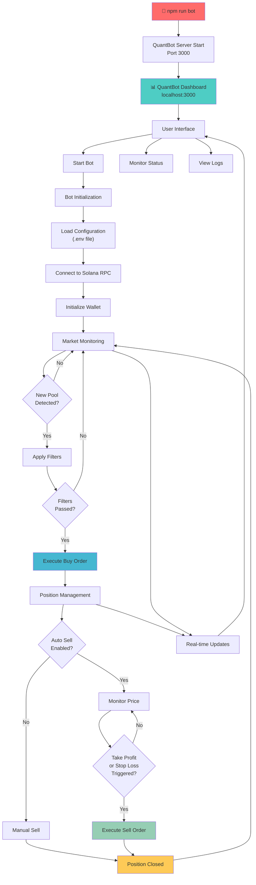

# 🚀 QuantBot v3.0 - Enterprise Dashboard Edition

[](LICENSE)
[]()
[]()
[]()

## 📋 Table of Contents

- [Overview](#-overview)
- [Architecture](#-architecture)
- [Features](#-features)
- [Quick Start](#-quick-start)
- [Configuration](#-configuration)
- [Web Dashboard](#-web-dashboard)
- [Trading Strategy](#-trading-strategy)
- [Security](#-security)
- [Troubleshooting](#-troubleshooting)
- [Incentive Campaign](#-incentive-campaign)
- [Support](#-support)

## 🎯 Overview

**QuantBot v3.0** is an advanced, enterprise-grade automated trading solution designed for the Solana blockchain ecosystem. This latest version features a comprehensive web-based dashboard interface, real-time market monitoring, and sophisticated risk management capabilities.

### Key Highlights

- **🎛️ Web-Based Dashboard**: Complete control through an intuitive localhost:3000 interface
- **⚡ Real-Time Trading**: Automated token sniping with configurable filters
- **🛡️ Advanced Risk Management**: Stop-loss, take-profit, and position sizing controls
- **📊 Live Monitoring**: Real-time portfolio tracking and trade analytics
- **🔧 Enterprise Configuration**: Extensive customization options via environment variables

## 🏗️ Architecture



## ✨ Features

### 🎛️ Web Dashboard Interface
- **Centralized Control Panel**: Start/stop bot operations from a clean web interface
- **Real-Time Monitoring**: Live portfolio status, active positions, and trade history
- **Market Analysis Tools**: Token scanner, whale activity tracker, and risk assessment
- **Signal Feed**: Real-time trading signals and market alerts

### 🤖 Automated Trading Engine
- **Smart Token Sniping**: Automated detection and trading of new token launches
- **Multi-Filter System**: Comprehensive token filtering based on liquidity, social presence, and metadata
- **Position Management**: Automated take-profit and stop-loss execution
- **Retry Logic**: Robust transaction handling with configurable retry mechanisms

### 🛡️ Risk Management
- **Portfolio Protection**: Configurable position sizing and maximum exposure limits
- **Stop-Loss Automation**: Automatic position closure on adverse price movements
- **Take-Profit Targets**: Systematic profit-taking at predefined levels
- **Market Condition Filters**: Protection against low-liquidity and manipulated tokens

## 🚀 Quick Start

### Prerequisites

- **Node.js**: Version 18.0.0 or higher
- **npm**: Latest version
- **Solana Wallet**: With SOL balance for trading and fees
- **RPC Access**: Helius, QuickNode, or similar provider

### Installation

1. **Clone Repository**
   ```bash
   git clone <repository-url>
   cd quantbot
   ```

2. **Install Dependencies**
   ```bash
   npm install
   ```

3. **Configure Environment**
   ```bash
   cp .env.example .env
   # Edit .env with your configuration
   ```

4. **Prepare Trading Balance**
   - Convert SOL to USDC or WSOL on [Jupiter](https://jup.ag/)
   - Recommended: Use WSOL for better performance

5. **Launch Dashboard**
   ```bash
   npm run bot
   ```
   
   The dashboard will automatically open at `http://localhost:3000`

## ⚙️ Configuration

### 🔐 Wallet Configuration

| Parameter | Description | Example |
|-----------|-------------|---------|
| `PRIVATE_KEY` | Your wallet's private key | `4YEk2k8n8GRC...` |

### 🌐 Network Configuration

| Parameter | Description | Default |
|-----------|-------------|---------|
| `RPC_ENDPOINT` | Solana RPC HTTP endpoint | Helius RPC |
| `RPC_WEBSOCKET_ENDPOINT` | Solana WebSocket endpoint | Helius WSS |
| `COMMITMENT_LEVEL` | Transaction commitment level | `confirmed` |

### 🤖 Bot Configuration

| Parameter | Description | Default |
|-----------|-------------|---------|
| `LOG_LEVEL` | Logging verbosity | `trace` |
| `ONE_TOKEN_AT_A_TIME` | Sequential token processing | `true` |
| `TRANSACTION_EXECUTOR` | Transaction executor type | `default` |
| `COMPUTE_UNIT_LIMIT` | Transaction compute limit | `101337` |
| `COMPUTE_UNIT_PRICE` | Transaction compute price | `421197` |

### 💰 Trading Configuration

#### Buy Parameters
| Parameter | Description | Default |
|-----------|-------------|---------|
| `QUOTE_MINT` | Trading pair base (USDC/WSOL) | `USDC` |
| `QUOTE_AMOUNT` | Amount per trade | `0.001` |
| `BUY_SLIPPAGE` | Maximum buy slippage (%) | `20` |
| `MAX_BUY_RETRIES` | Maximum buy attempts | `10` |

#### Sell Parameters
| Parameter | Description | Default |
|-----------|-------------|---------|
| `AUTO_SELL` | Enable automatic selling | `true` |
| `TAKE_PROFIT` | Take profit percentage | `40` |
| `STOP_LOSS` | Stop loss percentage | `20` |
| `SELL_SLIPPAGE` | Maximum sell slippage (%) | `20` |

### 🔍 Filter Configuration

| Parameter | Description | Default |
|-----------|-------------|---------|
| `CHECK_IF_BURNED` | Verify liquidity pool burn | `true` |
| `CHECK_IF_MINT_IS_RENOUNCED` | Verify mint authority renounced | `true` |
| `CHECK_IF_SOCIALS` | Require social media presence | `true` |
| `MIN_POOL_SIZE` | Minimum pool size (SOL) | `5` |
| `MAX_POOL_SIZE` | Maximum pool size (SOL) | `50` |

## 🎛️ Web Dashboard

### Dashboard Components

1. **🏠 Main Control Panel**
   - Bot start/stop controls
   - Real-time status indicators
   - Quick configuration access

2. **📊 Portfolio Status**
   - Current balance and P&L
   - Active positions overview
   - Performance metrics

3. **🎯 Active Positions**
   - Live position tracking
   - Individual P&L monitoring
   - Manual close options

4. **📈 Market Analysis**
   - Token performance metrics
   - Market trend indicators
   - Volume analysis

5. **🐋 Whale Activity Monitor**
   - Large transaction alerts
   - Whale wallet tracking
   - Market impact analysis

6. **⚠️ Risk Management**
   - Position size controls
   - Risk exposure metrics
   - Safety limit configuration

7. **📡 Signal Feed**
   - Real-time trading signals
   - Market opportunity alerts
   - Technical indicators

8. **🤖 AI Analysis**
   - Machine learning insights
   - Predictive analytics
   - Trading recommendations

### Access & Navigation

- **URL**: `http://localhost:3000`
- **Auto-Launch**: Browser opens automatically on startup
- **Responsive Design**: Works on desktop and mobile devices
- **Real-Time Updates**: Live data refresh without page reload

## 📈 Trading Strategy

### Market Scanning Process

1. **🔍 Pool Detection**: Monitor new liquidity pools in real-time
2. **📊 Filter Application**: Apply comprehensive token safety filters
3. **⚡ Rapid Execution**: Execute trades within milliseconds of detection
4. **📈 Position Management**: Monitor and manage open positions
5. **💰 Profit Realization**: Automatic profit-taking and loss mitigation

### Filter Categories

#### 🛡️ Security Filters
- **Mint Authority**: Verify renounced mint authority
- **Freeze Authority**: Check for freeze capability
- **Metadata Mutability**: Ensure immutable token metadata

#### 📊 Market Filters
- **Liquidity Requirements**: Minimum and maximum pool size validation
- **Social Verification**: Presence of official social media links
- **Burn Verification**: Liquidity pool burn confirmation

#### 📈 Performance Filters
- **Volume Thresholds**: Minimum trading volume requirements
- **Price Stability**: Volatility and price impact analysis
- **Market Depth**: Order book depth assessment

## 🔒 Security

### 🔐 Private Key Management
- **Local Storage**: Private keys never leave your machine
- **Encrypted Transmission**: All API calls use encrypted channels
- **No Key Sharing**: Zero private key exposure to external services

### 🛡️ Transaction Security
- **Signature Verification**: All transactions signed locally
- **Replay Protection**: Nonce-based transaction protection
- **Fee Validation**: Automatic fee calculation and validation

### 🌐 Network Security
- **RPC Redundancy**: Multiple RPC endpoint support
- **Connection Encryption**: TLS/SSL encrypted communications
- **Rate Limiting**: Built-in request throttling

## 🔧 Troubleshooting

### Common Issues

#### 🚫 RPC Node Errors
**Error**: `410 Gone: RPC call disabled`
**Solution**: Switch to a supported RPC provider (Helius, QuickNode)

#### 💳 Token Account Issues
**Error**: `No SOL token account found`
**Solution**: Create USDC/WSOL token accounts via [Jupiter](https://jup.ag/)

#### 🌐 Connection Problems
**Error**: WebSocket connection failures
**Solution**: Verify RPC WebSocket endpoint configuration

#### 💰 Insufficient Balance
**Error**: Transaction failures due to low balance
**Solution**: Ensure sufficient SOL for trades and network fees

### Debug Mode

Enable detailed logging:
```bash
# Set in .env file
LOG_LEVEL=debug
```

### Performance Optimization

1. **RPC Selection**: Use premium RPC providers for better performance
2. **Network Settings**: Optimize commitment levels for speed vs. security
3. **Filter Tuning**: Adjust filter parameters for market conditions
4. **Position Sizing**: Optimize trade sizes for gas efficiency

## 🎉 Incentive Campaign

### 🏆 Win Up to 10 SOL in Rewards!

**Campaign Period**: Until August 1, 2025

### Participation Requirements

1. **📊 Volume Requirement**
   - Use QuantBot continuously for 7 days
   - Achieve $100,000+ total transaction volume

2. **👥 Referral Bonus**
   - Refer at least 3 friends to QuantBot
   - Friends must achieve $30,000+ combined volume

### 🎁 Exclusive Benefits

- **💸 Fee Refunds**: Complete warp transaction fee refunds
- **🔗 Referral Rewards**: Additional rewards for successful referrals
- **🏅 Top Trader Bonus**: Monthly volume leader receives extra rewards

### 📞 Claim Process

Contact Discord: `warp_zara` to claim your rewards

> ⚠️ **Fair Play Policy**: Multiple accounts for reward farming are prohibited

## 🛠️ Advanced Features

### 🚀 Warp Transactions (Beta)

Enhanced transaction execution through third-party integrations:

- **⚡ Faster Execution**: Reduced transaction confirmation times
- **🔄 Higher Success Rate**: Improved transaction success rates  
- **💰 Fee Structure**: Distributed fees between developers and providers
- **🔒 Security**: Private keys never transmitted to external services

**Enable Warp**: Set `TRANSACTION_EXECUTOR=warp` in configuration

### 📋 Snipe Lists

Target specific tokens for trading:

1. **📝 Create List**: Add token addresses to `snipe-list.txt`
2. **⚙️ Enable Feature**: Set `USE_SNIPE_LIST=true`
3. **🔄 Auto-Refresh**: List updates automatically during operation

## 📞 Support

### 🆘 Getting Help

- **Discord Support**: `warp_zara`
- **Documentation**: Comprehensive guides and examples
- **Community**: Active trading community and discussions

### 🐛 Reporting Issues

1. **📊 Gather Information**: Set `LOG_LEVEL=debug` for detailed logs
2. **📝 Document Problem**: Include error messages and configuration
3. **📞 Contact Support**: Reach out via Discord with details

### 🚀 Feature Requests

We welcome suggestions for new features and improvements. Contact our team via Discord to discuss your requirements.

## ⚖️ Disclaimer

> **Risk Warning**: Cryptocurrency trading involves substantial risk and may result in significant losses. Past performance does not guarantee future results. This software is provided "as is" for educational purposes. Users assume full responsibility for their trading decisions and any resulting financial outcomes.

### 📜 Legal Compliance

- Ensure compliance with local regulations
- Understand tax implications of automated trading
- Verify legal status of cryptocurrency trading in your jurisdiction

---

## 🌟 Contributing

We appreciate community contributions! Please ensure your contributions align with our coding standards and security practices.

---

**Made with ❤️ by the QuantBot Development Team**

*Star ⭐ this repository if QuantBot helps your trading journey!*
