# 🚀 QuantBot v3.0 - Enterprise Meme Coin Trading Platform

[](LICENSE)
[]()
[]()
[]()
[]()
[]()

> ⚠️ **CRITICAL RISK WARNING**: Meme coin trading is extremely high-risk and speculative. You may lose your entire investment. This software is provided for educational purposes only. The developers assume NO LIABILITY for any financial losses incurred through the use of this software.

## 📋 Table of Contents

- [🚨 Risk Disclaimer & Legal Notice](#-risk-disclaimer--legal-notice)
- [🎯 Overview](#-overview)
- [🏗️ System Architecture](#️-system-architecture)
- [✨ Advanced Features](#-advanced-features)
- [🚀 Installation & Setup](#-installation--setup)
- [⚙️ Configuration Guide](#️-configuration-guide)
- [🎛️ Web Dashboard](#️-web-dashboard)
- [📈 Trading Strategies](#-trading-strategies)
- [🛡️ Security & Risk Management](#️-security--risk-management)
- [🔧 Advanced Configuration](#-advanced-configuration)
- [📊 Performance Optimization](#-performance-optimization)
- [🔍 Monitoring & Analytics](#-monitoring--analytics)
- [🐛 Troubleshooting](#-troubleshooting)
- [🎉 Incentive Program](#-incentive-program)
- [📞 Support & Community](#-support--community)
- [🌟 Contributing](#-contributing)
- [📜 Legal & Compliance](#-legal--compliance)

## 🚨 Risk Disclaimer & Legal Notice

### ⚠️ EXTREME RISK WARNING

**MEME COIN TRADING IS EXTREMELY HIGH-RISK AND SPECULATIVE**

- **Total Loss Risk**: You may lose 100% of your investment within minutes
- **Market Volatility**: Meme coins can experience 90%+ price swings in seconds
- **Liquidity Risk**: Tokens may become completely illiquid or worthless
- **Rug Pull Risk**: Projects may abandon tokens, causing total value loss
- **Technical Risk**: Smart contract bugs or exploits may result in fund loss
- **Regulatory Risk**: Regulatory changes may impact token legality or value

### 🚫 NO LIABILITY DISCLAIMER

**THE DEVELOPERS OF THIS SOFTWARE ASSUME ABSOLUTELY NO LIABILITY FOR:**
- Financial losses of any magnitude
- Trading decisions made by users
- Software bugs, errors, or malfunctions
- Market manipulation or external attacks
- Regulatory compliance issues
- Tax implications or reporting requirements

**BY USING THIS SOFTWARE, YOU ACKNOWLEDGE THAT:**
- You are trading at your own risk and discretion
- You understand the extreme volatility of meme coin markets
- You have sufficient technical knowledge to operate trading software
- You comply with all applicable laws and regulations in your jurisdiction
- You will not hold the developers responsible for any losses

### 📜 Educational Purpose Only

This software is provided **FOR EDUCATIONAL AND RESEARCH PURPOSES ONLY**. It is not:
- Financial advice or investment recommendations
- A guarantee of profits or trading success
- Suitable for inexperienced traders
- Compliant with all jurisdictions' regulations

**USE AT YOUR OWN RISK. TRADE RESPONSIBLY.**

---

## 🎯 Overview

**QuantBot v3.0** is a sophisticated, enterprise-grade automated trading platform specifically engineered for the high-velocity Solana meme coin ecosystem. This cutting-edge system combines advanced blockchain monitoring, machine learning-driven market analysis, and lightning-fast execution capabilities to capitalize on micro-second trading opportunities in the volatile meme coin market.

### 🎯 Core Mission

QuantBot v3.0 is designed to navigate the chaotic and highly speculative world of Solana meme coins by:
- **Detecting emerging tokens** within milliseconds of launch
- **Analyzing market sentiment** through whale activity and social signals
- **Executing precision trades** with advanced risk management
- **Maximizing profit potential** while minimizing exposure time

### 🚀 Revolutionary Features

- **🎛️ Enterprise Web Dashboard**: Military-grade control center with real-time analytics
- **⚡ Microsecond Execution**: Sub-second trade execution with advanced retry logic
- **🧠 AI-Powered Analysis**: Machine learning algorithms for market prediction
- **🐋 Whale Tracking**: Real-time monitoring of large wallet movements
- **🛡️ Advanced Risk Management**: Multi-layered protection systems
- **📊 Real-Time Analytics**: Live portfolio tracking and performance metrics
- **🔧 Infinite Customization**: 100+ configuration parameters for fine-tuning
- **🌐 Multi-RPC Support**: Redundant connections for maximum uptime
- **📱 Mobile Responsive**: Trade from anywhere with full mobile support

## 📁 Enterprise Project Architecture

```
QuantBot v3.0/ (Enterprise Trading Platform)
├── 📁 backend/                    # Core Trading Engine & API Server
│   ├── 📄 server.ts              # Express.js API server with WebSocket support
│   ├── 📄 index.ts               # Main application entry point
│   ├── 📄 bot.ts                 # Advanced trading bot orchestrator
│   ├── 📄 cache.ts               # High-performance caching layer
│   ├── 📁 transactions/          # Transaction execution engines
│   │   ├── 📄 default.ts         # Standard Solana transaction executor
│   │   ├── 📄 warp.ts            # High-speed warp transaction executor
│   │   └── 📄 retry.ts           # Intelligent retry mechanism
│   ├── 📁 listeners/             # Real-time market monitoring
│   │   ├── 📄 pumpfun.ts         # Pump.fun new token listener
│   │   ├── 📄 raydium.ts         # Raydium DEX integration
│   │   └── 📄 whale.ts           # Whale transaction tracker
│   ├── 📁 helpers/               # Core utility functions
│   │   ├── 📄 solana.ts          # Solana blockchain utilities
│   │   ├── 📄 jupiter.ts         # Jupiter aggregator integration
│   │   ├── 📄 metadata.ts        # Token metadata analyzer
│   │   └── 📄 risk.ts            # Risk assessment algorithms
│   ├── 📁 filters/               # Advanced token filtering system
│   │   ├── 📄 security.ts        # Security validation filters
│   │   ├── 📄 liquidity.ts       # Liquidity analysis filters
│   │   ├── 📄 social.ts          # Social media verification
│   │   └── 📄 technical.ts       # Technical analysis filters
│   ├── 📁 database/              # Data persistence layer
│   │   ├── 📄 portfolio.ts       # Portfolio management
│   │   ├── 📄 trades.ts          # Trade history tracking
│   │   └── 📄 analytics.ts       # Performance analytics
│   └── 📄 package.json           # Backend dependencies & scripts
├── 📁 frontend/                   # Next.js Enterprise Dashboard
│   ├── 📁 app/                   # Next.js 14 app router structure
│   │   ├── 📄 layout.tsx         # Root application layout
│   │   ├── 📄 page.tsx           # Main dashboard page
│   │   ├── 📁 dashboard/         # Dashboard route group
│   │   ├── 📁 analytics/         # Analytics & reporting
│   │   └── 📁 settings/          # Configuration management
│   ├── 📁 components/            # Reusable React components
│   │   ├── 📁 ui/                # Base UI components
│   │   ├── 📁 charts/            # Trading charts & visualizations
│   │   ├── 📁 trading/           # Trading-specific components
│   │   └── 📁 layout/            # Layout components
│   ├── 📁 lib/                   # Frontend utilities & hooks
│   │   ├── 📄 api.ts             # API client configuration
│   │   ├── 📄 websocket.ts       # Real-time data connections
│   │   └── 📄 utils.ts           # Utility functions
│   ├── 📁 styles/                # Styling & themes
│   └── 📄 package.json           # Frontend dependencies
├── 📁 docs/                      # Comprehensive documentation
│   ├── 📁 architecture/          # System architecture docs
│   ├── 📁 api/                   # API documentation
│   └── 📁 guides/                # User guides & tutorials
├── 📁 scripts/                   # Automation & deployment scripts
├── 📁 tests/                     # Comprehensive test suite
├── 📄 .env                       # Environment configuration
├── 📄 .env.example               # Configuration template
├── 📄 README.md                  # This comprehensive guide
├── 📄 LICENSE.md                 # MIT license
├── 📄 SECURITY.md                # Security guidelines
├── 📄 CONTRIBUTING.md            # Contribution guidelines
└── 📄 package.json               # Root monorepo configuration
```

### 🏗️ Technical Stack

| Layer | Technology | Purpose |
|-------|------------|---------|
| **Frontend** | Next.js 14, React 18, TypeScript | Enterprise dashboard interface |
| **Backend** | Node.js, Express.js, TypeScript | Trading engine & API server |
| **Blockchain** | Solana Web3.js, Jupiter SDK | Blockchain interaction |
| **Database** | SQLite, Redis (optional) | Data persistence & caching |
| **Real-time** | WebSockets, Server-Sent Events | Live data streaming |
| **Styling** | Tailwind CSS, Shadcn/ui | Modern, responsive design |
| **Monitoring** | Winston, Custom analytics | Logging & performance tracking |

## 🏗️ Architecture

```mermaid
graph TD
    A["🚀 npm run dev"] --> B["Frontend + Backend Start"]
    B --> C["📊 Next.js Dashboard<br/>localhost:3000"]
    B --> D["🔧 Express API Server<br/>localhost:3001"]
    C --> E["User Interface"]
    D --> F["Trading Bot API"]
    
    D --> E["Start Bot"]
    D --> F["Monitor Status"]
    D --> G["View Logs"]
    
    E --> H["Bot Initialization"]
    H --> I["Load Configuration<br/>(.env file)"]
    I --> J["Connect to Solana RPC"]
    J --> K["Initialize Wallet"]
    
    K --> L["Market Monitoring"]
    L --> M{"New Pool<br/>Detected?"}
    M -->|Yes| N["Apply Filters"]
    M -->|No| L
    
    N --> O{"Filters<br/>Passed?"}
    O -->|No| L
    O -->|Yes| P["Execute Buy Order"]
    
    P --> Q["Position Management"]
    Q --> R{"Auto Sell<br/>Enabled?"}
    R -->|No| S["Manual Sell"]
    R -->|Yes| T["Monitor Price"]
    
    T --> U{"Take Profit<br/>or Stop Loss<br/>Triggered?"}
    U -->|No| T
    U -->|Yes| V["Execute Sell Order"]
    
    S --> W["Position Closed"]
    V --> W
    W --> L
    
    X["Real-time Updates"] --> D
    Q --> X
    L --> X
    
    style A fill:#ff6b6b
    style C fill:#4ecdc4
    style P fill:#45b7d1
    style V fill:#96ceb4
    style W fill:#feca57
```



## ✨ Features

### 🎛️ Web Dashboard Interface
- **Centralized Control Panel**: Start/stop bot operations from a clean web interface
- **Real-Time Monitoring**: Live portfolio status, active positions, and trade history
- **Market Analysis Tools**: Token scanner, whale activity tracker, and risk assessment
- **Signal Feed**: Real-time trading signals and market alerts

### 🤖 Automated Trading Engine
- **Smart Token Sniping**: Automated detection and trading of new token launches
- **Multi-Filter System**: Comprehensive token filtering based on liquidity, social presence, and metadata
- **Position Management**: Automated take-profit and stop-loss execution
- **Retry Logic**: Robust transaction handling with configurable retry mechanisms

### 🛡️ Risk Management
- **Portfolio Protection**: Configurable position sizing and maximum exposure limits
- **Stop-Loss Automation**: Automatic position closure on adverse price movements
- **Take-Profit Targets**: Systematic profit-taking at predefined levels
- **Market Condition Filters**: Protection against low-liquidity and manipulated tokens

## 🚀 Installation & Setup

### 🔧 System Requirements

| Component | Minimum | Recommended | Enterprise |
|-----------|---------|-------------|------------|
| **Node.js** | v18.0.0 | v20.0.0+ | v21.0.0+ |
| **RAM** | 4GB | 8GB | 16GB+ |
| **Storage** | 10GB | 50GB | 100GB+ |
| **Network** | 10 Mbps | 100 Mbps | 1 Gbps+ |
| **OS** | macOS/Linux/Windows | macOS/Linux | Linux Server |

### 📋 Prerequisites Checklist

- [ ] **Node.js 18+** installed with npm/yarn
- [ ] **Git** for repository management
- [ ] **Solana Wallet** with private key access
- [ ] **RPC Provider** (Helius, QuickNode, Alchemy)
- [ ] **Trading Capital** (minimum 0.1 SOL recommended)
- [ ] **Basic Terminal** knowledge
- [ ] **Risk Management** understanding

### 🛠️ Professional Installation

#### 1. Repository Setup
```bash
# Clone the repository
git clone https://github.com/your-username/quantbot-v3.git
cd quantbot-v3

# Verify Node.js version
node --version  # Should be 18.0.0 or higher
npm --version   # Should be 8.0.0 or higher
```

#### 2. Dependency Installation
```bash
# Install all dependencies (frontend + backend)
npm run install:all

# Alternative: Install separately
npm install                    # Root dependencies
cd backend && npm install     # Backend dependencies
cd ../frontend && npm install # Frontend dependencies
cd ..
```

#### 3. Environment Configuration
```bash
# Copy environment template
cp .env.example .env

# Edit configuration (use your preferred editor)
nano .env
# OR
code .env
# OR
vim .env
```

#### 4. Wallet & RPC Setup

**Required Environment Variables:**
```bash
# Wallet Configuration
PRIVATE_KEY=your_wallet_private_key_here

# RPC Configuration (Choose one)
RPC_ENDPOINT=https://mainnet.helius-rpc.com/?api-key=YOUR_KEY
RPC_WEBSOCKET_ENDPOINT=wss://mainnet.helius-rpc.com/?api-key=YOUR_KEY

# Trading Configuration
QUOTE_MINT=USDC  # or WSOL
QUOTE_AMOUNT=0.001  # Amount per trade in SOL/USDC
```

#### 5. Trading Capital Preparation

**Option A: USDC (Recommended for beginners)**
```bash
# 1. Visit Jupiter Exchange: https://jup.ag/
# 2. Connect your wallet
# 3. Swap SOL → USDC
# 4. Keep some SOL for transaction fees
```

**Option B: WSOL (Recommended for advanced users)**
```bash
# 1. Visit Jupiter Exchange: https://jup.ag/
# 2. Connect your wallet  
# 3. Wrap SOL → WSOL
# 4. Better performance for high-frequency trading
```

#### 6. Application Launch

**Full Stack Launch (Recommended):**
```bash
npm run dev
```

**Component-Specific Launch:**
```bash
# Backend only (API + Trading Engine)
npm run backend:dev

# Frontend only (Dashboard Interface)
npm run frontend:dev

# Production mode
npm run build
npm run start
```

#### 7. Access & Verification

- **Dashboard**: http://localhost:3000
- **API Server**: http://localhost:3001
- **Health Check**: http://localhost:3001/health
- **WebSocket**: ws://localhost:3001

### 🔍 Installation Verification

```bash
# Check if all services are running
curl http://localhost:3001/health
curl http://localhost:3001/api/status

# Check WebSocket connection
wscat -c ws://localhost:3001

# Verify wallet connection
curl http://localhost:3001/api/wallet/balance
```

### 🚨 Common Installation Issues

| Issue | Cause | Solution |
|-------|-------|----------|
| `Node version error` | Outdated Node.js | Install Node.js 18+ |
| `Port already in use` | Conflicting services | Kill processes or change ports |
| `RPC connection failed` | Invalid RPC endpoint | Verify RPC URL and API key |
| `Wallet not found` | Invalid private key | Check private key format |
| `Insufficient balance` | Low SOL balance | Add more SOL to wallet |

### 🔧 Advanced Installation Options

#### Docker Installation (Coming Soon)
```bash
# Build and run with Docker
docker-compose up -d

# Access dashboard
open http://localhost:3000
```

#### Cloud Deployment
```bash
# Deploy to VPS/Cloud
npm run deploy:production

# Environment-specific deployments
npm run deploy:staging
npm run deploy:development
```

## ⚙️ Configuration

### 🔐 Wallet Configuration

| Parameter | Description | Example |
|-----------|-------------|---------|
| `PRIVATE_KEY` | Your wallet's private key | `4YEk2k8n8GRC...` |

### 🌐 Network Configuration

| Parameter | Description | Default |
|-----------|-------------|---------|
| `RPC_ENDPOINT` | Solana RPC HTTP endpoint | Helius RPC |
| `RPC_WEBSOCKET_ENDPOINT` | Solana WebSocket endpoint | Helius WSS |
| `COMMITMENT_LEVEL` | Transaction commitment level | `confirmed` |

### 🤖 Bot Configuration

| Parameter | Description | Default |
|-----------|-------------|---------|
| `LOG_LEVEL` | Logging verbosity | `trace` |
| `ONE_TOKEN_AT_A_TIME` | Sequential token processing | `true` |
| `TRANSACTION_EXECUTOR` | Transaction executor type | `default` |
| `COMPUTE_UNIT_LIMIT` | Transaction compute limit | `101337` |
| `COMPUTE_UNIT_PRICE` | Transaction compute price | `421197` |

### 💰 Trading Configuration

#### Buy Parameters
| Parameter | Description | Default |
|-----------|-------------|---------|
| `QUOTE_MINT` | Trading pair base (USDC/WSOL) | `USDC` |
| `QUOTE_AMOUNT` | Amount per trade | `0.001` |
| `BUY_SLIPPAGE` | Maximum buy slippage (%) | `20` |
| `MAX_BUY_RETRIES` | Maximum buy attempts | `10` |

#### Sell Parameters
| Parameter | Description | Default |
|-----------|-------------|---------|
| `AUTO_SELL` | Enable automatic selling | `true` |
| `TAKE_PROFIT` | Take profit percentage | `40` |
| `STOP_LOSS` | Stop loss percentage | `20` |
| `SELL_SLIPPAGE` | Maximum sell slippage (%) | `20` |

### 🔍 Filter Configuration

| Parameter | Description | Default |
|-----------|-------------|---------|
| `CHECK_IF_BURNED` | Verify liquidity pool burn | `true` |
| `CHECK_IF_MINT_IS_RENOUNCED` | Verify mint authority renounced | `true` |
| `CHECK_IF_SOCIALS` | Require social media presence | `true` |
| `MIN_POOL_SIZE` | Minimum pool size (SOL) | `5` |
| `MAX_POOL_SIZE` | Maximum pool size (SOL) | `50` |

## 🎛️ Web Dashboard

### Dashboard Components

1. **🏠 Main Control Panel**
   - Bot start/stop controls
   - Real-time status indicators
   - Quick configuration access

2. **📊 Portfolio Status**
   - Current balance and P&L
   - Active positions overview
   - Performance metrics

3. **🎯 Active Positions**
   - Live position tracking
   - Individual P&L monitoring
   - Manual close options

4. **📈 Market Analysis**
   - Token performance metrics
   - Market trend indicators
   - Volume analysis

5. **🐋 Whale Activity Monitor**
   - Large transaction alerts
   - Whale wallet tracking
   - Market impact analysis

6. **⚠️ Risk Management**
   - Position size controls
   - Risk exposure metrics
   - Safety limit configuration

7. **📡 Signal Feed**
   - Real-time trading signals
   - Market opportunity alerts
   - Technical indicators

8. **🤖 AI Analysis**
   - Machine learning insights
   - Predictive analytics
   - Trading recommendations

### Access & Navigation

- **URL**: `http://localhost:3000`
- **Auto-Launch**: Browser opens automatically on startup
- **Responsive Design**: Works on desktop and mobile devices
- **Real-Time Updates**: Live data refresh without page reload

## 📈 Trading Strategy

### Market Scanning Process

1. **🔍 Pool Detection**: Monitor new liquidity pools in real-time
2. **📊 Filter Application**: Apply comprehensive token safety filters
3. **⚡ Rapid Execution**: Execute trades within milliseconds of detection
4. **📈 Position Management**: Monitor and manage open positions
5. **💰 Profit Realization**: Automatic profit-taking and loss mitigation

### Filter Categories

#### 🛡️ Security Filters
- **Mint Authority**: Verify renounced mint authority
- **Freeze Authority**: Check for freeze capability
- **Metadata Mutability**: Ensure immutable token metadata

#### 📊 Market Filters
- **Liquidity Requirements**: Minimum and maximum pool size validation
- **Social Verification**: Presence of official social media links
- **Burn Verification**: Liquidity pool burn confirmation

#### 📈 Performance Filters
- **Volume Thresholds**: Minimum trading volume requirements
- **Price Stability**: Volatility and price impact analysis
- **Market Depth**: Order book depth assessment

## 🔒 Security

### 🔐 Private Key Management
- **Local Storage**: Private keys never leave your machine
- **Encrypted Transmission**: All API calls use encrypted channels
- **No Key Sharing**: Zero private key exposure to external services

### 🛡️ Transaction Security
- **Signature Verification**: All transactions signed locally
- **Replay Protection**: Nonce-based transaction protection
- **Fee Validation**: Automatic fee calculation and validation

### 🌐 Network Security
- **RPC Redundancy**: Multiple RPC endpoint support
- **Connection Encryption**: TLS/SSL encrypted communications
- **Rate Limiting**: Built-in request throttling

## 🔧 Troubleshooting

### Common Issues

#### 🚫 RPC Node Errors
**Error**: `410 Gone: RPC call disabled`
**Solution**: Switch to a supported RPC provider (Helius, QuickNode)

#### 💳 Token Account Issues
**Error**: `No SOL token account found`
**Solution**: Create USDC/WSOL token accounts via [Jupiter](https://jup.ag/)

#### 🌐 Connection Problems
**Error**: WebSocket connection failures
**Solution**: Verify RPC WebSocket endpoint configuration

#### 💰 Insufficient Balance
**Error**: Transaction failures due to low balance
**Solution**: Ensure sufficient SOL for trades and network fees

### Debug Mode

Enable detailed logging:
```bash
# Set in .env file
LOG_LEVEL=debug
```

### Performance Optimization

1. **RPC Selection**: Use premium RPC providers for better performance
2. **Network Settings**: Optimize commitment levels for speed vs. security
3. **Filter Tuning**: Adjust filter parameters for market conditions
4. **Position Sizing**: Optimize trade sizes for gas efficiency

## 🎉 Incentive Campaign

### 🏆 Win Up to 10 SOL in Rewards!

**Campaign Period**: Until August 1, 2025

### Participation Requirements

1. **📊 Volume Requirement**
   - Use QuantBot continuously for 7 days
   - Achieve $100,000+ total transaction volume

2. **👥 Referral Bonus**
   - Refer at least 3 friends to QuantBot
   - Friends must achieve $30,000+ combined volume

### 🎁 Exclusive Benefits

- **💸 Fee Refunds**: Complete warp transaction fee refunds
- **🔗 Referral Rewards**: Additional rewards for successful referrals
- **🏅 Top Trader Bonus**: Monthly volume leader receives extra rewards

### 📞 Claim Process

Contact Discord: `warp_zara` to claim your rewards

> ⚠️ **Fair Play Policy**: Multiple accounts for reward farming are prohibited

## 🛠️ Advanced Features

### 🚀 Warp Transactions (Beta)

Enhanced transaction execution through third-party integrations:

- **⚡ Faster Execution**: Reduced transaction confirmation times
- **🔄 Higher Success Rate**: Improved transaction success rates  
- **💰 Fee Structure**: Distributed fees between developers and providers
- **🔒 Security**: Private keys never transmitted to external services

**Enable Warp**: Set `TRANSACTION_EXECUTOR=warp` in configuration

### 📋 Snipe Lists

Target specific tokens for trading:

1. **📝 Create List**: Add token addresses to `snipe-list.txt`
2. **⚙️ Enable Feature**: Set `USE_SNIPE_LIST=true`
3. **🔄 Auto-Refresh**: List updates automatically during operation

## 📞 Support

### 🆘 Getting Help

- **Discord Support**: `warp_zara`
- **Documentation**: Comprehensive guides and examples
- **Community**: Active trading community and discussions

### 🐛 Reporting Issues

1. **📊 Gather Information**: Set `LOG_LEVEL=debug` for detailed logs
2. **📝 Document Problem**: Include error messages and configuration
3. **📞 Contact Support**: Reach out via Discord with details

### 🚀 Feature Requests

We welcome suggestions for new features and improvements. Contact our team via Discord to discuss your requirements.

## 📜 Legal & Compliance

### ⚖️ COMPREHENSIVE DISCLAIMER

> **EXTREME RISK WARNING**: Meme coin trading represents one of the highest-risk investment activities possible. The extreme volatility, lack of fundamental value, and speculative nature of meme coins can result in complete and total loss of invested capital within minutes or seconds. This software is provided strictly for educational and research purposes.

### 🚫 ABSOLUTE LIABILITY WAIVER

**THE DEVELOPERS, CONTRIBUTORS, AND DISTRIBUTORS OF THIS SOFTWARE:**
- **DISCLAIM ALL WARRANTIES** express or implied, including merchantability and fitness for purpose
- **ASSUME NO LIABILITY** for any direct, indirect, incidental, special, or consequential damages
- **PROVIDE NO GUARANTEES** regarding software performance, accuracy, or profitability
- **ACCEPT NO RESPONSIBILITY** for trading losses, technical failures, or security breaches
- **OFFER NO SUPPORT** for financial losses or investment decisions

### 📋 USER ACKNOWLEDGMENTS

By using this software, you explicitly acknowledge and agree that:

1. **Financial Risk**: You may lose 100% of your invested capital
2. **Technical Risk**: Software may contain bugs, errors, or security vulnerabilities
3. **Market Risk**: Cryptocurrency markets are extremely volatile and unpredictable
4. **Regulatory Risk**: Legal status of cryptocurrencies varies by jurisdiction
5. **Operational Risk**: Trading automation may execute unintended transactions
6. **Liquidity Risk**: Tokens may become illiquid or worthless
7. **Counterparty Risk**: Third-party services may fail or become unavailable

### 🌍 Regulatory Compliance

**USERS MUST ENSURE COMPLIANCE WITH:**
- Local securities and commodities regulations
- Anti-money laundering (AML) requirements
- Know Your Customer (KYC) obligations
- Tax reporting and payment obligations
- Professional licensing requirements (if applicable)
- Import/export restrictions on financial software

### 🏛️ Jurisdictional Restrictions

This software may not be legal in all jurisdictions. Users are responsible for:
- Verifying legal status in their location
- Obtaining necessary licenses or permissions
- Complying with local financial regulations
- Understanding tax implications

### 📊 Tax Implications

Automated trading may generate significant tax obligations:
- High-frequency trading may trigger wash sale rules
- Short-term capital gains may apply to profits
- Professional trader status may affect tax treatment
- Record-keeping requirements may be extensive

---

## 🌟 Contributing

We welcome contributions from the community! However, all contributors must:

### 📋 Contribution Requirements
- **Code Quality**: Follow TypeScript best practices and ESLint rules
- **Security**: Undergo security review for all financial-related code
- **Testing**: Provide comprehensive test coverage for new features
- **Documentation**: Include detailed documentation for all changes
- **Legal**: Agree to contributor license agreement

### 🔒 Security Standards
- All code must pass security audits
- No hardcoded private keys or sensitive data
- Follow secure coding practices
- Report security vulnerabilities responsibly

### 📝 Development Process
1. Fork the repository
2. Create a feature branch
3. Implement changes with tests
4. Submit pull request with detailed description
5. Pass code review and security audit

---

## 📞 Support & Community

### 🆘 Support Channels
- **Discord**: `warp_zara` (Primary support)
- **GitHub Issues**: Bug reports and feature requests
- **Documentation**: Comprehensive guides and API docs

### ⚠️ Support Limitations
**SUPPORT IS PROVIDED ON A BEST-EFFORT BASIS ONLY:**
- No guaranteed response times
- No financial advice or trading recommendations
- No liability for support quality or accuracy
- No obligation to fix bugs or implement features

### 🤝 Community Guidelines
- Be respectful and professional
- No financial advice or trading signals
- Share knowledge and help others learn
- Report security issues privately
- Follow all applicable laws and regulations

---

## 🎯 Final Warning

**THIS SOFTWARE IS EXPERIMENTAL AND UNAUDITED**

- Use only funds you can afford to lose completely
- Start with minimal amounts for testing
- Understand all risks before proceeding
- Seek professional financial advice if needed
- Never invest more than you can afford to lose

**REMEMBER: In meme coin trading, the house always wins. Trade responsibly.**

---

**Made with ⚡ by the QuantBot Development Team**

*⭐ Star this repository if you find it educational, but remember: past performance does not guarantee future results!*

---

*Last Updated: January 2025 | Version 3.0.0 | License: MIT*
